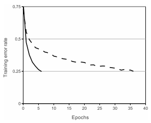
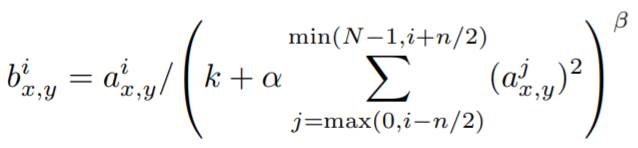
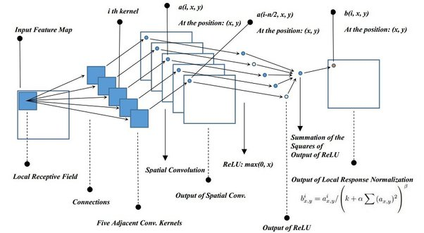
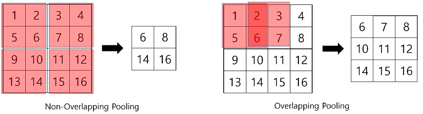
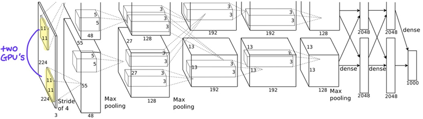
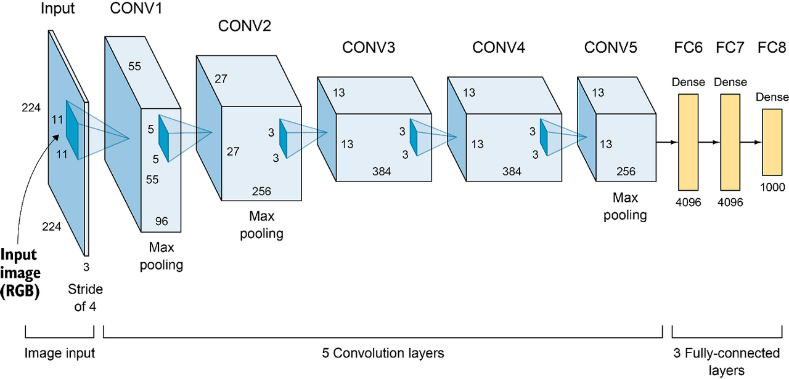

# AlexNet(ImageNet Classification with Deep Convolutional Neural Networks)
> Paper : [ImageNet Classification with Deep Convolutional Neural Networks](https://proceedings.neurips.cc/paper_files/paper/2012/file/c399862d3b9d6b76c8436e924a68c45b-Paper.pdf)

## 1. Introduction
AlexNet은 대규모 데이터셋을 활용한 딥러닝 모델이 이미지 분류에서 기존의 전통적인 머신러닝 방법을 크게 능가할 수 있음을 보인 대표적인 연구이다. 이 논문은 CNN(Convolutional Neural Network)을 기반으로 한 AlexNet이 ImageNet Large Scale Visual Recognition Challenge (ILSVRC) 2012에서 압도적인 성능을 기록하며 딥러닝의 발전을 가속화하는 계기가 되었다.

AlexNet 이전에는 HOG나 SIFT 방법으로 이미지의 특징을 추출하고 SVM 같은 머신러닝 기반 방법들을 사용하는 것이 SOTA였으나, 해당 논문이 발표되고 Deep Learning과 GPU에 대한 관심이 확대되기 시작했다. 

특히 AlexNet은 100만개 가량의 대규모 데이터셋을 CNN 구조를 통해 학습했는데, 이러한 방법을 통해 기존의 MLP 구조보다 더 적은 파라미터를 가지면서도 유사한 성능을 보였다. 또한 고해상도 이미지 처리를 위해 GPU를 활용했다는 것에 의미가 있는 모델이다.

## 2. Dataset
 - ImageNet 데이터셋은 22,000개의 카테고리가 있는 150만개의 고해상도 이미지
 - 2010년부터 ILSVRC 대회에서는 ImageNet의 사진 중에서 약 1000개의 카테고리 별로 1000개의 사진을 골라서 대회에서 사용
 - 논문에서 사용된 학습 데이터는 120만 개의 train dataset

## 3. The Architecture
3.1 **ReLU(Rectified Linear Unit) 활성화 함수 적용**
   - 기존의 sigmoid나 tanh보다 기울기 소실(vanishing gradient) 문제를 완화하고 학습 속도를 향상시킴.  
   

      
   

   - 위 그래프는 하이퍼볼릭 탄젠트 함수(점선)과 ReLU(실선)의 학습 오차가 얼마나 빠르게 감소하는지에 대한 그래프
   - 학습 오차를 25% 이하로 낮추는데 하이퍼볼릭 탄젠트에 비해 ReLU가 약 6배 정도 빠른 것을 확인
   - non-saturating 활성함수의 사용은 AlexNet이 처음은 아니었다. $|tanh(x)|$ 와 같은 non-saturating nonlinearities 함수를 사용한 논문이 있으며 saturating nonlinearities가 아닌 non-saturating nonlinearities 함수를 통해 오버피팅을 방지했다는 발표가 있었다. 하지만, AlexNet이 필요로 한 것은 빠른 학습 속도이었기에 ReLU를 사용하게 되었다고 한다.  

   
3.2 **GPU를 활용한 대규모 병렬 학습**
   - 120만 개의 학습 데이터셋을 단일 GPU로 처리하는 데 한계
   - NVIDIA GTX 580 GPU 두 개를 사용하여 모델을 병렬 연산하도록 설계하여 학습 속도를 가속화함.  

3.3 **Local Response Normalization (LRN) 사용**
   - 왜 Local Response Normalization을 사용하게 되었을까?  
      - ReLU는 양수 방향의 입력은 그대로 출력하기 때문에 값이 특정 픽셀 값이 과도하게 커지는 경향이 있음
      - 그렇게 되면 Conv나 Pooling시에 매우 높은 특정 픽셀 값이 주변의 픽셀에 영향을 미치게 됨
      - **이러한 문제점을 해결하기 위해서 다른 ActivationMap의 같은 위치에 있는 픽셀끼리 정규화를 진행하는 것이 LRN의 기본 아이디어**
   
   
   

      
   

   
   

   $b^{i}_{x,y}$ : LRN한 Activation 결과   
   
   $a^{i}_{x,y}$ : Activation 결과  
   
   $i$  : 현재 Filter  
   
   $n$ : 고려해야 하는 Filter 개수  
   
   $N$ : 총 Filter 개수  
   
   $k, \alpha, \beta$ : Hyperparameters(논문에서는 2, 0.0001, 0.75가 가장 좋다고 함)
    
   

   

      
   

   - $i=5, n=5$ 라고 가정했을 때 5번째 필터에 해당하는 값을 같은 위치(픽셀)의 다른 필터 5개의 제곱합으로 나누어주게 됩니다.
   - 위의 과정을 진행했을 때 값이 클수록 큰 값을 나누어주게 되어 상대적으로 작아지고, 반대로 값이 작을수록 작은 값을 나누어주게 되므로 기존 값이 상대적으로 커지는 효과가 있습니다. 

   - 현재는 Batch Normalization의 등장으로 잘 사용하지 않는 normalization 기법
      - LRN은 BN 대비 연산 비용이 크고 성능 향상도 좋지 않다고 함
   - LRN은 구조상 Activation 뒤에 위치하지만, Batch Normalization은 Activation Function 앞에 적용된다.

3.4 **Overlapping Pooling**
   - 기존에 CNN에서는 Pooling을 진행할 때 겹치지 않게 하는 게 일반적
   - Overlapping Pooling은 max pooling을 진행할 때 stride를 커널 사이즈보다 작게 설정하기 때문에 겹쳐지게 연산됨
   - 해당 기법을 적용한 덕분에 Top-1 에러율을 0.4%, Top-5 에러율을 0.3% 감소할 수 있었음
   

## 4. 네트워크 구조
AlexNet의 구조는 다음과 같이 8개의 학습 가능한 층으로 구성

   

   

- **입력 데이터**: 227×227×3 크기의 RGB 이미지
- **Conv1**: 11×11 필터, 96개 커널, 스트라이드 4, LRN 및 Max Pooling 적용
- **Conv2**: 5×5 필터, 256개 커널, LRN 및 Max Pooling 적용
- **Conv3**: 3×3 필터, 384개 커널
- **Conv4**: 3×3 필터, 384개 커널
- **Conv5**: 3×3 필터, 256개 커널, Max Pooling 적용
- **FC6**: 4096개의 뉴런, Dropout 적용
- **FC7**: 4096개의 뉴런, Dropout 적용
- **FC8**: 1000개의 뉴런 (ImageNet 1000 클래스 분류)
- **출력 층**: Softmax 활성화 함수 적용

## 5. Reducing Overfitting
5.1 **데이터 증강(Data Augmentation) 활용**  
   - 좌우 반전
   - PCA를 활용한 RGB 변환  
      > 주성분분석(PCA)를 진행하고 평균(0), 표준편차(0.1)을 갖는 가우시안 분포에서 랜덤 변수를 추출한 후, 원래의 픽셀 값에 곱해주어 색상의 변형을 주는 방법

5.2 **Dropout 기법 도입**  
   - 과적합(overfitting)을 방지하기 위해 Fully Connected Layer에서 뉴런을 확률적으로 제거하는 Dropout을 적용함.

## 6. Details of Learning

### 🔹 Optimizer
- **SGD (Stochastic Gradient Descent)**  
- **Momentum**: 0.9  
- **Weight Decay**: 5e-4  

### 🔹 Training Hyperparameters
- **Batch Size**: 128  
- **Learning Rate**: 0.01  
- **Learning Rate Adjustment**:  
  - Validation error가 현재 learning rate(lr)에서 더 이상 개선되지 않으면 **lr을 10으로 나눔**  
  - 초기 lr: **0.01**  
  - 총 **3번 감소**  

### 🔹 Training Epochs
- **Total Epochs**: 90  

### 🔹 Weight Initialization
- 모든 레이어의 가중치는 **편차 0.01을 가지는 zero-mean Gaussian 정규 분포**로 초기화  

### 🔹 Neuron Bias 설정
- **Bias 값이 1인 레이어**:  
  - **2, 4, 5번째 Convolution 레이어**  
  - **Fully-Connected 레이어**  
- **Bias 값이 0인 레이어**:  
  - 위에 언급된 레이어를 제외한 모든 레이어  

## reference
- [논문 리뷰] AlexNet / ImageNet Classification with Deep CNN : https://killerwhale0917.tistory.com/14  
- [pytorch] 이미지 분류를 위한 AlexNet 구현 : https://resultofeffort.tistory.com/106  
- AlexNet Implementation(구현) by PyTorch
 : https://teddylee777.github.io/pytorch/alexnet-implementation/
- [논문 구현] AlexNet 파이토치로 구현하기 : https://roytravel.tistory.com/336
- Source code for torchvision.models.alexnet : https://pytorch.org/vision/main/_modules/torchvision/models/alexnet.html#alexnet

## 피드백 및 후기

### 피드백  
**논문 구현 스터디 대전제** 
- 우리 스터디는 논문 연구가 아니라 논문에 있는 걸 잘 가져다가 최신의 트렌드에 맞게 잘 쓰는 것이다.   
- 대전제에 맞게 학습 방향을 가져가는 게 좋다.  

**논문 정리 팁**  
- 요즘 잘 안 쓰이는 방법들은 왜 요즘 잘 안쓰이는지 정도만 정리하고, 자세하게 설명할 필요없음(LRN 같이 요즘 안쓰는 방법들을 굳이 자세하게 팔 필요없음)  
- 과거 아키텍처에서 개선되는 부분이 있다면 자세하게 설명(AlexNet의 경우 1개의 GPU로 사용가능하기 때문에 기존 논문에서 구조적 변경이 있었고, 아키텍처 이미지도 바꿔줘야할 필요가 있음)  
- 중요한 내용만 압축해서 요약 정리  

**코드 정리 팁** 
- learning rate 스케줄러는 내가 쓴 코드 말고도 다른 코드로 적용할 수 있는데, 이런 것처럼 다양한 메소드를 활용해보려고 시도해야함  
- LRN같이 요즘 잘 안쓰이는 애들은 과감하게 생략하고 batch norm으로 대체해서 구현해도 됨, 개선 사항을 최신 트렌드에 맞게 반영 -> 대전제 반영  
- 주석을 최대한 많이 달아서 몇 달 뒤에 봤을 때도 이해가 가도록 정리하는 게 중요함, 코드 가독성은 덜 중요함  
- train시에 overfitting 되는 파라미터와 best 파라미터 간 성능 비교 및 실제 inference 시각화도 해보면 좋음  
- API serving도 해보면 좋음( 모델의 Agent화(서비스화) )  

### 후기  
**느낀점**    
- 생각보다 밑바닥부터 코드 구현하기가 까다로웠다.
- 모델 아키텍처보다는 데이터 로드와 전처리 부분, 그리고 학습을 진행하는 train 과 test 함수 구성이 유독 어렵게 느껴졌다.  

**아쉬운점**  
- 성능 비교를 벤치마크 말고 실제 데이터 시각화를 진행해보려고 했는데 생각보다 난이도가 있어서 완성하지 못했던 부분  
- streamlit으로 데모버전도 구현해서 테스트 해볼 수 있도록 하는 부분  
 
**배운점**  
- AlexNet의 컨볼루젼 구조 이외에도 LRN이나 가중치 초기화 같은 디테일적인 부분이 생각보다 많다는 것을 알게 되었다.   
- 실험을 반복적으로 진행하다보니까 조절해야하는 옵션을 바꿀 때마다(예를 들어 데이터셋) 코드 전체를 바꿔줘야하는 부분이 불편했는데, 실험을 위한 코드 패키지화를 왜 진행하는지 알게 되었다.  
- 다음과 같은 순서로 진행하는게 가장 빠르고 깊게 학습할 수 있는 방법인 것을 알게 되었다. 1) 논문 블로그 리뷰 참고 2) 논문 가볍게 읽기 3) 논문 "코드" 전체 구조 먼저 구현 4) 논문 "내용 정리"를 위한 전체 구조 먼저 작성 5) "코드" 디테일 구현 6) "논문 내용" 디테일 정리  

